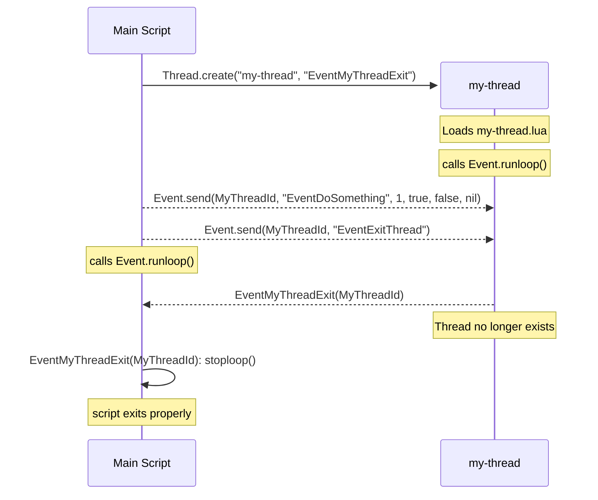

# ComEXE builtins

- [Multithreading](#multithreading)
- [libffi](#libffi)
- [luv: Cross-platform asynchronous I/O](#luv-cross-platform-asynchronous-io)
- [luasocket](#luasocket)
- [mbedtls](#mbedtls)

# Multithreading

ComEXE multithreading is based on OS-level native threads, not Lua green threads or coroutines. Each thread runs its own Lua interpreter and communicates with other threads using the event system.

## Quick start



**[my-thread.lua](../tests/examples/my-thread.lua)**

```lua title="my-thread.lua"
local Event = require("com.event")

function EventDoSomething (...)
  print("EventDoSomething", ...)
end

function EventExitThread ()
  Event.stoploop()
end

-- Block until stoploop() is called
Event.runloop()
print("my-thread close")
```

**[test-doc-main-thread.lua](../tests/examples/test-doc-main-thread.lua)**

```lua title="test-doc-main-thread.lua"
local uv = require("luv")

local Thread = require("com.thread")
local Event  = require("com.event")

-- Called when my-thread.lua exits
function EventMyThreadExit (ThreadId)
  Thread.join(ThreadId) -- Release the thread ID
  Event.stoploop()      -- Stop the loop
end

-- Create the thread by loading my-thread.lua
local ThreadId = Thread.create("my-thread", "EventMyThreadExit")

uv.sleep(1000)
Event.send(ThreadId, "EventDoSomething", 1, true, false, nil)
uv.sleep(1000)

Event.send(ThreadId, "EventExitThread")

-- Block until stoploop() is called
Event.runloop()
print("test-doc-main-thread close")
```

This will output:

```
>lua55ce.exe tests\examples\test-doc-main-thread.lua
EventDoSomething        1       true    false   nil
my-thread close
test-doc-main-thread close
```

## Overview

The multithreading library makes it easy to develop native multithreaded applications in Lua:
* `Thread.create` spawns a new Lua interpreter in a separate OS thread and loads the requested module
* Threads communicate with `Event.send`, which essentially enqueues an event to the target thread
* An event is just a call to a global Lua function
* When a thread exits, the parent is notified with a thread-exit event

Supported event argument types:
- [X] nil
- [X] booleans
- [X] light userdata
- [X] numbers
- [X] strings
- [ ] tables
- [ ] functions
- [ ] full userdata
- [ ] coroutines

Tables and other complex Lua values are not supported. If you need to send a more complex object between threads, serialize it to a string first using a library such as [binser](https://github.com/bakpakin/binser) or [dkjson](https://dkolf.de/dkjson-lua).

# libffi

ComEXE includes Sourceware [libffi](https://github.com/libffi/libffi)  through the `com.ffi` package. This is not [LuaJIT](https://luajit.org/ext_ffi.html)'s `ffi`, and the API is different.

See [tests/examples/test-doc-ffi.lua](../tests/examples/test-doc-ffi.lua) for an example.

# luv: Cross-platform asynchronous I/O

ComEXE uses [libuv](https://libuv.org) for portability. [luv](https://github.com/luvit/luv) is also included because it is [popular on LuaRocks](https://luarocks.org/search?q=libuv). This library has everything a man could wish for: [timers](https://github.com/luvit/luv/blob/master/docs/docs.md#uv_timer_t--timer-handle), [processes](https://github.com/luvit/luv/blob/master/docs/docs.md#uv_process_t--process-handle), [sockets](https://github.com/luvit/luv/blob/master/docs/docs.md#uv_tcp_t--tcp-handle), [pipes](https://github.com/luvit/luv/blob/master/docs/docs.md#uv_pipe_t--pipe-handle), [ttys](https://github.com/luvit/luv/blob/master/docs/docs.md#uv_tty_t--tty-handle), [file-systems](https://github.com/luvit/luv/blob/master/docs/docs.md#file-system-operations), [threads](https://github.com/luvit/luv/blob/master/docs/docs.md#threading-and-synchronization-utilities), and other [utilities](https://github.com/luvit/luv/blob/master/docs/docs.md#miscellaneous-utilities). You can read the [documentation on GitHub](https://github.com/luvit/luv/blob/master/docs/docs.md).

# luasocket

## Overview

ComEXE embeds [LuaSocket](https://lunarmodules.github.io/luasocket/index.html):

* Fetch resources from HTTP and HTTPS via `socket.http`
* TLS support is available for HTTP but support for FTP, SMTP, and other socket protocols may be limited

## Example fetching HTTPS

```lua title="test-fetch-http.lua"
local http = require("socket.http")
local URI  = "https://github.com/pascalcombier/comexe/blob/main/README.md"

local BodyString, StatusCode, ResponseHeaders, StatusLine = http.request(URI)

print("Body Length", #BodyString)
print("HttpCode", StatusCode)
if ResponseHeaders then
  print("Response Headers", #ResponseHeaders)
else
  print("Response Headers none")
end
print("StatusLine", StatusLine)
```

This should give you this output:

```sh
E:\my-program>lua55ce-x86_64-windows.exe test-http.lua
Body Length      229287
HttpCode         200
Response Headers 0
StatusLine       HTTP/1.1 200 OK
```

## Example decoding JSON data

JSON is supported by [installing third-party packages](./standalone-executables.md) and [dkjson](https://dkolf.de/dkjson-lua) can be installed:

```
lua55ce.exe -x --apm install dkjson-2.8
```

Use the JSON library as [documented](https://dkolf.de/dkjson-lua/):

```
local json = require("dkjson")
local http = require("socket.http")
local URI  = "https://api.github.com"

local JsonString, HttpCode, ResponseHeaders, StatusLine = http.request(URI)

if (HttpCode == 200) then
  local JsonObject = json.decode(JsonString)
  if JsonObject then
    for Key, Value in pairs(JsonObject) do
      print(string.format("%q = %q", Key, Value))
    end
  end
end
```

This should output the [GitHub JSON API](https://api.github.com):
```
"issue_search_url" = "https://api.github.com/search/issues?q={query}{&page,per_page,sort,order}"
"current_user_repositories_url" = "https://api.github.com/user/repos{?type,page,per_page,sort}"
"authorizations_url" = "https://api.github.com/authorizations"
"repository_url" = "https://api.github.com/repos/{owner}/{repo}"
"public_gists_url" = "https://api.github.com/gists/public"
...
```

This example use `dkjson`, but multiple other JSON libraries can be used as well.

## Example encoding JSON data

```lua
local json = require("dkjson")

local LuaObject  = { Hello = "world", Answer = 42 }
local JsonString = json.encode(LuaObject)
print(string.format("%q", JsonString))
```

This should output:

```
"{\"Answer\":42,\"Hello\":\"world\"}"
```

# mbedtls

ComEXE embeds [mbedtls](https://github.com/Mbed-TLS/mbedtls) and [lua-mbedtls](https://github.com/neoxic/lua-mbedtls)
