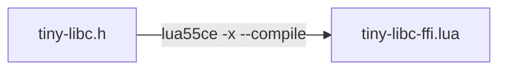

# Foreign Function Interface in ComEXE

* [Overview](#overview)
  * [Generating a binding file](#generating-a-binding-file)
  * [Loading a shared library](#loading-a-shared-library)
  * [Attaching a binding](#attaching-a-binding)
  * [Calling foreign functions](#calling-foreign-functions)
  * [Sorting arrays of structures](#sorting-arrays-of-structures)
* [FFI Module API](#ffi-module-api)
  * [Basic workflow](#basic-workflow)
  * [Constants](#constants)
  * [Main functions](#main-functions)
  * [Library objects](#library-objects)
  * [Array objects](#array-objects)
  * [Structure type objects](#structure-type-objects)
  * [Structure instance objects](#structure-instance-objects)
  * [Callback objects](#callback-objects)
* [Memory allocation](#memory-allocation)
  * [Allocate memory using mimalloc](#allocate-memory-using-mimalloc)
  * [Allocate memory without mimalloc](#allocate-memory-without-mimalloc)
  * [Functions](#functions)
  * [Memory ownership](#memory-ownership)
  * [Comparing pointers and NULL](#comparing-pointers-and-null)
* [Limitations](#limitations)

# Overview

This module uses [libffi](https://github.com/libffi/libffi) to call **foreign functions** in shared libraries (`.dll` on Windows, `.so` on Linux). Lua can call them like normal Lua functions, no C compiler needed.

- Pointers, `malloc`, `free` and segfaults for Lua ♥
- Call foreign functions, including variadics like `sprintf`
- Implement callbacks in Lua for functions like `qsort`
- Structures and arrays

## Generating a binding file

ComEXE includes a tool to generate bindings from `C` headers. It is based on [Facebook CParser](https://github.com/facebookresearch/CParser).



**[tiny-libc.h](../tests/examples/ffi/tiny-libc.h)**

```
void *malloc  (size_t size);
void  free    (void *ptr);
int   puts    (const char* str);
int   sprintf (char *str, const char *format, ...);
void  qsort   (void *base, size_t num, size_t size, void *compar);
```

**Compile the header into a binding file**:

```console
lua55ce.exe -x --compile tiny-libc.h
```

The generated **tiny-libc-ffi.lua** is a Lua module intended to be loaded by `ffi.loadlib`.

**[tiny-libc-ffi.lua](../tests/examples/ffi/tiny-libc-ffi.lua)**

```
--------------------------------------------------------------------------------
-- Generated by ComEXE ffi-compiler at 2026-05-24T07:22:31                    --
-- tiny-libc.h                                                                --
--------------------------------------------------------------------------------

local libffi = require("com.ffi")

--------------------------------------------------------------------------------
-- FUNCTIONS                                                                  --
--------------------------------------------------------------------------------

local function Bind (Library)
  -- Functions
  Library.free = Library:bind(libffi.void, "free", libffi.pointer)
  Library.malloc = Library:bind(libffi.pointer, "malloc", libffi.uint64)
  Library.puts = Library:bind(libffi.sint32, "puts", libffi.pointer)
  Library.qsort = Library:bind(libffi.void, "qsort", libffi.pointer, libffi.uint64, libffi.uint64, libffi.pointer)
  Library.sprintf = Library:variadicbind(libffi.sint32, "sprintf", libffi.pointer, libffi.pointer)
end

--------------------------------------------------------------------------------
-- PUBLIC API                                                                 --
--------------------------------------------------------------------------------

local PUBLIC_API = {
  bind = Bind,
}

return PUBLIC_API
```

## Loading a shared library

```lua
local ffi  = require("com.ffi")

local libc = ffi.loadlib("msvcrt.dll")
```

It searches standard OS paths (executable directory, `PATH`, system directories) and returns a library object if found, or `nil` if the library is not found. Library names differ across operating systems, so it also accepts a list of OS and library name pairs:

```lua
local libc = ffi.loadlib("windows", "msvcrt.dll", "linux", "libc.so", "linux", "libc.so.1")
```

Returns the first matching pair. On Windows it tries `"msvcrt.dll"`, on Linux `"libc.so"` then `"libc.so.1"`. String case matters: use `"linux"`, not `"Linux"`.

## Attaching a binding

```lua
local ffi     = require("com.ffi")
local LibcFfi = require("tiny-libc-ffi")

local libc = ffi.loadlib("windows", "msvcrt.dll", "linux", "libc.so")

libc:attach(LibcFfi)
```

`require("tiny-libc-ffi")` loads the FFI binding module. `libc:attach(LibcFfi)` registers its functions, constants, and structures on the library object.

## Calling foreign functions

**[test-tiny-libc.lua](../tests/examples/ffi/test-tiny-libc.lua)**

```lua
local ffi     = require("com.ffi")
local LibcFfi = require("tiny-libc-ffi")

-- Load DLL and attach FFI interface (multiple interface can be attached)
local libc = ffi.loadlib("windows", "msvcrt.dll", "linux", "libc.so", "linux", "libc.so.6")
libc:attach(LibcFfi)

local Buffer = libc.malloc(1024)

if (Buffer ~= ffi.NULL) then
  local Count = libc.sprintf(Buffer, "Hello, %s! int=%d float=%f", "FFI", 42, 3.14)
  print(string.format("snprintf returned %d", Count))
  libc.puts(Buffer)
  libc.free(Buffer)
  print("OK")
else
  error("sprintf failed")
end
```

Note that pointers are *light userdata* and **the `NULL` pointer is not `nil`**. That program should output:

```console
> lua55ce tests/examples/ffi/test-tiny-libc.lua
snprintf returned 33
Hello, FFI! int=42 float=3.140000
OK
```

## Sorting arrays of structures

This example sorts an **array of structures** by calling `qsort` with a **Lua callback**.

**[test-doc-struct-qsort.lua](../tests/examples/ffi/test-doc-struct-qsort.lua)**

```lua
local ffi     = require("com.ffi")
local LibcFfi = require("tiny-libc-ffi")

local format = string.format

-- Load DLL and attach FFI interface
local libc = ffi.loadlib("windows", "msvcrt.dll", "linux", "libc.so", "linux", "libc.so.6")
libc:attach(LibcFfi)

local UserStruct = ffi.newstructure("User",
  ffi.int32_t, "Id",
  ffi.cstring, "Name",
  ffi.int32_t, "Age"
)

local function CompareByAge (PointerA, PointerB)
  local UserA = UserStruct:cast(PointerA)
  local UserB = UserStruct:cast(PointerB)
  return (UserA:get("Age") - UserB:get("Age"))
end

local CompareCallback = ffi.newcallback(CompareByAge, ffi.int32_t, ffi.pointer, ffi.pointer)

local function ConfigureUser (Array, Index, Id, Name, Age)
  local User = Array:get(Index)
  User:set("Id",   Id)
  User:set("Name", Name)
  User:set("Age",  Age)
end

local function PrintUsers (Array, Label)
  print(Label)
  local ElementCount = Array:getcount()
  for Index = 1, ElementCount do
    local User = Array:get(Index)
    local Name = User:get("Name")
    local Age  = User:get("Age")
    print(format("  %4.4s - Age %d", Name, Age))
  end
end

local Users = ffi.newarray(UserStruct, 4)

ConfigureUser(Users, 1, 3, "Zoe",  28)
ConfigureUser(Users, 2, 1, "Amy",  35)
ConfigureUser(Users, 3, 4, "Carl", 22)
ConfigureUser(Users, 4, 2, "Bob",  42)

local UserStructSize = UserStruct:getsizeinbytes()
local ArrayPointer   = Users:getpointer()
local ComparePointer = CompareCallback:getpointer()

PrintUsers(Users, "Before")
local Count = Users:getcount()
libc.qsort(ArrayPointer, Count, UserStructSize, ComparePointer)
PrintUsers(Users, "After")
```

The program sorts the users by age and outputs:

```console
> lua55ce tests/examples/ffi/test-doc-struct-qsort.lua
Before
   Zoe - Age 28
   Amy - Age 35
  Carl - Age 22
   Bob - Age 42
After
  Carl - Age 22
   Zoe - Age 28
   Amy - Age 35
   Bob - Age 42
```

# FFI Module API

## Basic workflow

```lua
local ffi          = require("com.ffi")
local InterfaceFfi = require("interface-ffi")

-- Load the DLL
local dll = ffi.loadlib("library.dll")

dll:attach(InterfaceFfi)

-- Call the functions
dll.myfunction()
```

## Constants

| Constant             | C type        | Description                               |
|----------------------|---------------|-------------------------------------------|
| `ffi.void`           | `void`        | No return / no parameter                  |
| `ffi.int8_t`         | `int8_t`      | Signed 8-bit integer                      |
| `ffi.uint8_t`        | `uint8_t`     | Unsigned 8-bit integer                    |
| `ffi.int16_t`        | `int16_t`     | Signed 16-bit integer                     |
| `ffi.uint16_t`       | `uint16_t`    | Unsigned 16-bit integer                   |
| `ffi.int32_t`        | `int32_t`     | Signed 32-bit integer                     |
| `ffi.uint32_t`       | `uint32_t`    | Unsigned 32-bit integer                   |
| `ffi.int64_t`        | `int64_t`     | Signed 64-bit integer                     |
| `ffi.uint64_t`       | `uint64_t`    | Unsigned 64-bit integer                   |
| `ffi.float`          | `float`       | 32-bit IEEE floating-point                |
| `ffi.double`         | `double`      | 64-bit IEEE floating-point                |
| `ffi.pointer`        | `void*`       | Generic pointer                           |
| `ffi.complex_float`  | `float[2]`    | Complex float (compiler-dependent)        |
| `ffi.complex_double` | `double[2]`   | Complex double (compiler-dependent)       |
| `ffi.size_t`         | `size_t`      | Convenience                               |
| `ffi.cstring`        | `const char*` | Auto conversion between C and Lua strings |
| `ffi.NULL`           | `NULL`        | Null pointer (light userdata)             |

## Main functions

| Function                                                           | Returns                    | Description                                                           |
|--------------------------------------------------------------------|----------------------------|-----------------------------------------------------------------------|
| `ffi.loadlib("library.dll")`                                       | Library object or nil      | Load a shared library.                                                |
| `ffi.loadlib("os", "dll", ...)`                                    | Library object or nil      | Load a shared library. Accepts OS-name and library-name pairs.        |
| `ffi.newcallback(Function, ReturnType, ...)`                       | Callback object            | Wrap a Lua function into a C callback.                                |
| `ffi.newstructure("Name", fieldtype, "fieldname", ...)`            | StructureType, ErrorString | Create a structure type from alternating field types and field names. |
| `ffi.newarray(Type, Count)`                                        | Array object               | Allocate a GC-managed array of `Count` elements of the given type.    |
| `ffi.newinstance(Type)`                                            | Structure instance         | Allocate and return one structure instance.                           |
| `ffi.sizeof(Type)`                                                 | size in bytes              | Return the size in bytes of any FFI type, including structures.       |
| `ffi.importfunction(FunctionPointer, ReturnType, ParamType1, ...)` | Function, PrivateContext   | Import a C function into Lua from a pointer.                          |
| `ffi.readstring(Pointer [, Offset])`                               | string                     | Read a null-terminated C string from a pointer.                       |

## Library objects

Library objects are returned by `ffi.loadlib`.

| Method                                                       | Description                                                                                                                          |
|--------------------------------------------------------------|--------------------------------------------------------------------------------------------------------------------------------------|
| `lib:bind(ReturnType, "Name", ParamType1, ...)`              | Return a Lua function that calls the named symbol with the given signature.                                                          |
| `lib:variadicbind(ReturnType, "Name", FixedParamType1, ...)` | Return a Lua variadic wrapper. Types of variadic arguments are inferred on each call and wrappers are cached per inferred signature. |
| `lib:attach(ModuleTable)`                                    | Attach a module table (from `require`) that registers functions, constants, and structures on this library.                          |
| `lib:addlibrary(...)`                                        | Load an additional shared library. Symbols resolve across all loaded libraries. Accepts same args as `ffi.loadlib`.                  |

Example:

```lua
local ffi  = require("com.ffi")
local libc = ffi.loadlib("msvcrt.dll")

local void    = ffi.void
local int32_t = ffi.int32_t
local pointer = ffi.pointer

local puts    = libc:bind(int32_t, "puts", pointer)
local sprintf = libc:variadicbind(int32_t, "sprintf", pointer)
```

For `variadicbind`, C types are inferred:

| Lua value            | Inferred C type | Notes                                                                     |
|----------------------|-----------------|---------------------------------------------------------------------------|
| `nil`                | `pointer`       | Resolves to NULL                                                          |
| `string`             | `pointer`       |                                                                           |
| `boolean`            | `int32_t`       | 1 or 0                                                                    |
| `number` *"integer"* | `int32_t`       | Via [math.type](https://www.lua.org/manual/5.5/manual.html#pdf-math.type) |
| `number` *"float"*   | `double`        | Via [math.type](https://www.lua.org/manual/5.5/manual.html#pdf-math.type) |
| `lightuserdata`      | `pointer`       |                                                                           |
| structure instance   | `pointer`       | Via `instance:getpointer()`                                               |
| array                | `pointer`       | Via `array:getpointer()`                                                  |

`lib:addlibrary` loads additional shared libraries. This allows a single binding file to link multiple DLLs. Symbols are looked up across all loaded libraries:

```lua
local Win32Ffi = require("win32-ffi")

local win32 = ffi.loadlib("kernel32.dll")
win32:addlibrary("user32.dll")
win32:addlibrary("advapi32.dll")
win32:addlibrary("shell32.dll")
win32:attach(Win32Ffi)
```

## Array objects

Resizable array objects are returned by `ffi.newarray(Type, Count)`. The arrays grows automatically when `array:set` is called.

| Method                      | Description                                                          |
|-----------------------------|----------------------------------------------------------------------|
| `Array:get(Index)`          | Read the structure instance at the given 1-based index.              |
| `Array:set(Index, Value)`   | Write a value to the given 1-based index.                            |
| `Array:getcount()`          | Return the number of elements in the array.                          |
| `Array:copyfrom(LuaTable)`  | Copy elements from a Lua table into the array, resizing if needed.   |
| `Array:totable()`           | Convert the array to a plain Lua table of structure instances.       |
| `Array:getpointer([Index])` | Return pointer to first element, or to element at `Index` (1-based). |

## Structure type objects

Structure type objects are returned by `ffi.newstructure`.

| Method                           | Description                                                                            |
|----------------------------------|----------------------------------------------------------------------------------------|
| `StructType:gettypename()`       | Return structure type name.                                                            |
| `StructType:getffitype()`        | Return underlying ffi_type handle.                                                     |
| `StructType:getalignment()`      | Return required alignment in bytes.                                                    |
| `StructType:getsizeinbytes()`    | Return total structure size in bytes.                                                  |
| `StructType:getoffsets()`        | Return an array of field offsets in bytes.                                             |
| `StructType:setoffsets(Offsets)` | Override field offsets computed by libffi. Returns nil on success, or an error string. |
| `StructType:cast(Pointer)`       | Create a structure instance view over existing memory. No allocation is performed.     |

Ways to create structure instances:

* `ffi.newarray(Type, Count)` allocates an array.
* `ffi.newinstance(Type)` allocates a single instance.

## Structure instance objects

Structure instance objects are returned by `ffi.newinstance`, `ffi.newarray`, or `StructType:cast`.

| Method                      | Description                                           |
|-----------------------------|-------------------------------------------------------|
| `Instance:set(Name, Value)` | Write one field by name.                              |
| `Instance:get(Name)`        | Read one field by name.                               |
| `Instance:getpointer()`     | Return the pointer to this instance in native memory. |

## Callback objects

**Callback objects** wrap a Lua function in a C-callable function pointer.

Callback objects are returned by `ffi.newcallback(Function, ReturnType, ...)`. 

| Method                  | Description                                      |
|-------------------------|--------------------------------------------------|
| `Callback:getpointer()` | Return the C function pointer for this callback. |

# Memory allocation

ComEXE uses [mimalloc](https://github.com/microsoft/mimalloc) as its system allocator. It follows the same design as [GLib](https://docs.gtk.org/glib/memory.html#memory-allocation): if an allocation fails, the program prints an error message and exits.

## Allocate memory using mimalloc

```lua
local ffi = require("com.ffi")

local Buffer = ffi.malloc(1024)

-- The pointer is always valid and can be used directly

ffi.free(Buffer)
```

## Allocate memory without mimalloc

`malloc` can also be called directly from the standard C library, bypassing `mimalloc`. Unlike `ffi.malloc`, the returned pointer may be `NULL`.

```lua
local LibcFfi = require("tiny-libc-ffi")

local libc = ffi.loadlib("windows", "msvcrt.dll", "linux", "libc.so")
libc:attach(LibcFfi)

local Buffer = libc.malloc(1024)
if (Buffer ~= ffi.NULL) then
  -- use Buffer
  libc.free(Buffer)
end
```

## Functions

| Function                          | Returns       | Description                                                                                                                 |
|-----------------------------------|---------------|-----------------------------------------------------------------------------------------------------------------------------|
| `ffi.getpagesize()`               | integer       | Return the OS page size in bytes.                                                                                           |
| `ffi.malloc(Size)`                | lightuserdata | Allocate `Size` bytes (zero-initialized). Always returns a valid pointer.                                                   |
| `ffi.realloc(Pointer, Size)`      | lightuserdata | Resize an existing allocation. Always returns a valid pointer.                                                              |
| `ffi.free(Pointer)`               |               | Release memory allocated by `ffi.malloc`, `ffi.realloc`, or `ffi.allocstring`.                                              |
| `ffi.memset(Pointer, Byte, Size)` |               | Fill `Size` bytes at `Pointer` with `Byte` value.                                                                           |
| `ffi.allocstring(String)`         | lightuserdata | Allocate a null-terminated C-string copy of `String`. Memory is managed manually. Always returns a valid pointer.                                       |
| `ffi.newcstring(String)`          | table         | Create a GC-managed C-string wrapper. Memory is automatically freed by the garbage collector: no manual `ffi.free` needed. |

## Memory ownership

| Source                       | Memory Management | Details                   |
|------------------------------|-------------------|---------------------------|
| `ffi.malloc(Size)`           | Manual            | `ffi.free`                |
| `ffi.realloc(Pointer, Size)` | Manual            | `ffi.free`                |
| `ffi.allocstring(String)`    | Manual            | `ffi.free`                |
| `ffi.newcstring(String)`     | Automatic         | Garbage collector         |
| `ffi.newarray(Type, Count)`  | Automatic         | Garbage collector         |
| `ffi.newinstance(Type)`      | Automatic         | Garbage collector         |
| `Struct:cast(Pointer)`       | None              | View over existing memory |

## Comparing pointers and NULL

The `NULL` pointer in FFI is a **light userdata**, not Lua's `nil`. Always use `ffi.NULL` for comparison, never `nil`:

```lua
local LibcFfi = require("tiny-libc-ffi")

local libc = ffi.loadlib("windows", "msvcrt.dll", "linux", "libc.so")
libc:attach(LibcFfi)

local Buffer = libc.malloc(1024)
if (Buffer == ffi.NULL) then
  error("allocation failed")
end
libc.free(Buffer)
```

# Limitations

- Currently only 64-bit
- 32-bit calling convention split (cdecl vs stdcall) is not supported.
- Nested or recursive callbacks are not supported.

    
