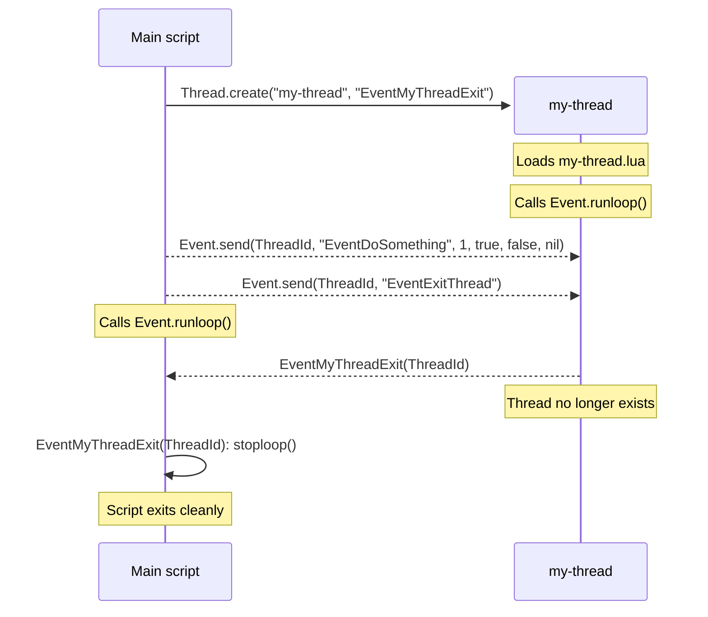

# Multithreading in ComEXE

* [Overview](#overview)
* [Example](#example)
* [Functions in module com.thread](#functions-in-module-comthread)
* [Functions in module com.event](#functions-in-module-comevent)
* [Technical notes](#technical-notes)

# Overview

ComEXE multithreading uses **OS-level native threads**, not green threads or coroutines. Each thread runs its **own Lua interpreter** and communicates with other threads through **an event system**. Every thread has its own event queue, and queued events are processed in FIFO order. The event system is **asynchronous**, so a thread can post an event, but there is no guarantee when it will be processed.

```lua
local Thread = require("com.thread")
local Event  = require("com.event")
```

**Threads are created with `Thread.create`**:

```lua
Thread.create(ModuleName, ExitEventName)
```

- `ModuleName` is the name of the module to load. For example, `Thread.create("my-thread", "EventMyThreadExit")` calls `require("my-thread")` at startup, and `require` will try to load `my-thread.lua`.

- `ExitEventName` is the name of the **event handler** called when the new thread exits.

An **event handler**:
- **Must be a global function**. ComEXE internally calls [lua_getglobal](https://www.lua.org/manual/5.5/manual.html#lua_getglobal), so local functions cannot be used.
- May return values, but the system will **ignore** them.

```lua
function EventMyThreadExit (...)
end
```

**Events are queued with `Event.send`**:

```lua
Event.send(ThreadId, EventName, ...)
```

- `ThreadId` is the integer thread identifier returned by `Thread.create`.
- `EventName` is the name of a **global function** in the target thread.
- `...` are the arguments passed to that function.

Example:

```lua
Event.send(MyThreadId, "MyEvent", 1, 2, 3)
```

Supported event argument types:
- [X] `nil`
- [X] booleans
- [X] light userdata
- [X] numbers
- [X] strings
- [ ] tables
- [ ] functions
- [ ] full userdata
- [ ] coroutines

If you need to send a complex object to a thread, serialize it to a string first with a library such as [binser](https://github.com/bakpakin/binser) or [dkjson](https://dkolf.de/dkjson-lua).

**Events are only processed after calling `Event.runloop`** (or `Event.runonce`):

```lua
Event.runloop() -- Allow received events to be processed
```

**An event handler typically stops the loop by calling `Event.stoploop`**:

```lua
local Thread = require("com.thread")
local Event  = require("com.event")

-- Event called when my-thread.lua exits
function EventMyThreadExit (ThreadId)
  Thread.join(ThreadId) -- Release the thread ID
  Event.stoploop()      -- Stop the event loop of the current thread
end

-- Create a new thread and load my-thread.lua
local ThreadId = Thread.create("my-thread", "EventMyThreadExit")

-- Wait for the event "EventMyThreadExit"
Event.runloop()
```

# Example



**[my-thread.lua](../tests/examples/my-thread.lua)**

```lua title="my-thread.lua"
local Event = require("com.event")

function EventDoSomething (...)
  print("EventDoSomething", ...)
end

function EventExitThread ()
  Event.stoploop()
end

-- Block until stoploop() is called
Event.runloop()
print("my-thread closed")
```

**[test-doc-main-thread.lua](../tests/examples/test-doc-main-thread.lua)**

```lua title="test-doc-main-thread.lua"
local uv = require("luv")

local Thread = require("com.thread")
local Event  = require("com.event")

-- Called when my-thread.lua exits
function EventMyThreadExit (ThreadId)
  Thread.join(ThreadId) -- Release the thread ID
  Event.stoploop()      -- Stop the loop
end

-- Create a new thread and load my-thread.lua
local ThreadId = Thread.create("my-thread", "EventMyThreadExit")

uv.sleep(1000)
Event.send(ThreadId, "EventDoSomething", 1, true, false, nil)
uv.sleep(1000)

Event.send(ThreadId, "EventExitThread")

-- Block until stoploop() is called
Event.runloop()
print("test-doc-main-thread closed")
```

This outputs:

```text
>lua55ce.exe tests\examples\test-doc-main-thread.lua
EventDoSomething        1       true    false   nil
my-thread closed
test-doc-main-thread closed
```

# Functions in module com.thread

| Function                                   | Description                                                                                                                                                                         |
|--------------------------------------------|-------------------------------------------------------------------------------------------------------------------------------------------------------------------------------------|
| `Thread.create(ModuleName, ExitEventName)` | Create a new thread that loads `ModuleName`. `ExitEventName` is the name of the exit handler in the parent thread. Returns the thread ID on success, or `nil` on invalid arguments. |
| `Thread.getid()`                           | Return the current thread ID as an integer.                                                                                                                                         |
| `Thread.getname()`                         | Return the current thread module name as a string. Returns `"main"` for the main thread.                                                                                            |
| `Thread.join(ThreadId)`                    | Wait for a thread to exit. Returns `true` if the join succeeds, or `false` if the thread ID is invalid.                                                                             |

# Functions in module com.event

| Function                               | Description                                                                                                                                                                                |
|----------------------------------------|--------------------------------------------------------------------------------------------------------------------------------------------------------------------------------------------|
| `Event.send(ThreadId, EventName, ...)` | Queue an event for a target thread. Supported types are `nil`, strings, numbers, booleans, and light userdata. Returns `true` if delivered, or `false` if the target thread ID is invalid. |
| `Event.broadcast(EventName, ...)`      | Queue an event for all running threads. No return value.                                                                                                                                   |
| `Event.runonce()`                      | Process all pending events once for the current thread. No return value.                                                                                                                   |
| `Event.runloop()`                      | Run the event loop until `Event.stoploop()` is called. No return value.                                                                                                                    |
| `Event.stoploop()`                     | Request that the current thread event loop stop. No return value.                                                                                                                          |

# Technical notes

## API flexibility

ComEXE intentionally keeps the API flexible. Thread references are simple integer values, so they can be passed between threads to build more complex behaviors.

## Thread lifecycle warning

Created threads are not automatically released. **Threads must be released by calling `Thread.join(ThreadId)`**. Every call to `Thread.create` should have a corresponding call to `Thread.join`. If the main program exits while a child thread is still running, ComEXE treats this as a **programming error and prints a warning**.

Note that event handlers can be reused:
```
function EventThreadExit (ThreadId)
  Thread.join(ThreadId) -- Release the thread ID
end

-- Create threads
local Thread1 = Thread.create("thread-impl-1", "EventThreadExit")
local Thread2 = Thread.create("thread-impl-2", "EventThreadExit")
local Thread3 = Thread.create("thread-impl-3", "EventThreadExit")
```

## Interfacing with other event loops

Several libraries use event loops, including libuv, IUP, and Copas. To integrate with those libraries, use `Event.runonce()`.
