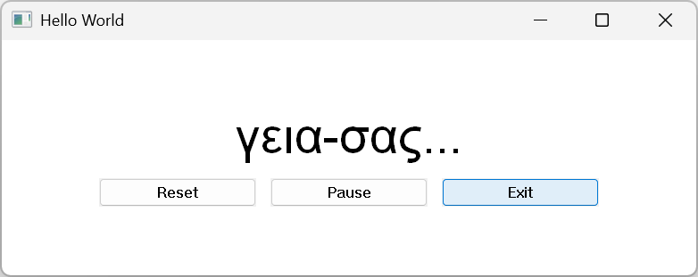
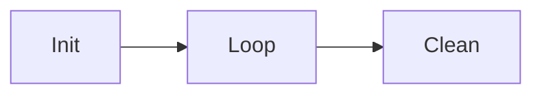

# Using the FFI to build a Win32 GUI

* [Introduction](#introduction)
* [References](#references)
* [Implementing the application](#implementing-the-application)
  * [Win32 binding](#win32-binding)
  * [Loading Win32 DLLs and attaching the generated Win32 binding](#loading-win32-dlls-and-attaching-the-generated-win32-binding)
  * [Unicode conversion](#unicode-conversion)
  * [Example Structure](#example-structure)
  * [State Machine](#state-machine)
  * [Retrieving string dimensions](#retrieving-string-dimensions)
  * [Window Procedure](#window-procedure)
  * [Init](#init)
  * [Main loop](#main-loop)
  * [Clean](#clean)
* [Full listing](#full-listing)

# Introduction

This guide shows how ComEXE's libffi can be used to develop **native Windows GUI applications**:
  * Unicode strings
  * Win32 styles
  * Automatic widget layout



# References

Covered in other documents:

  * [Generating bindings from C headers](./comexe-reference-ffi.md#generating-a-binding-file)
  * [Loading a DLL](./comexe-reference-ffi.md#loading-a-shared-library)
  * [Calling foreign functions](./comexe-reference-ffi.md#calling-foreign-functions)
  * [Implementing Callbacks](./comexe-reference-ffi.md#callback-objects)

Further links:
  * [ComEXE FFI reference document](./comexe-reference-ffi.md)
  * [Guide on binding `SQLite` with ComEXE](./page-ffi-sqlite.md)
  * [Microsoft documentation of Win32 API](https://learn.microsoft.com/en-us/windows/win32/api/)

# Implementing the application

## Win32 binding

Compile the Win32 declarations into a Lua binding:

**[tiny-win32.h](../tests/examples/ffi/tiny-win32.h)** → `lua55ce -x --compile` → **[tiny-win32-ffi.lua](../tests/examples/ffi/tiny-win32-ffi.lua)**

## Attaching the generated Win32 binding

The Win32 API is split across several DLLs. All declarations go in one header, so we maintain only one binding. Load the DLLs and attach the interface together:

```lua
local ffi      = require("com.ffi")
local Win32Ffi = require("tiny-win32-ffi")

local win32 = ffi.loadlib("kernel32.dll")
win32:addlibrary("user32.dll")
win32:addlibrary("gdi32.dll")

win32:attach(Win32Ffi)
```

After loading, `win32` exposes the Win32 constants and functions used below.

## Unicode conversion

Win32 functions expect UTF-16 strings, so we convert from UTF-8:

```c
int MultiByteToWideChar(
  [in]            UINT                              CodePage,
  [in]            DWORD                             dwFlags,
  [in]            _In_NLS_string_(cbMultiByte)LPCCH lpMultiByteStr,
  [in]            int                               cbMultiByte,
  [out, optional] LPWSTR                            lpWideCharStr,
  [in]            int                               cchWideChar
);
```

We define the UTF-8 code page:

```c
/* UTF-8 code page */
#define CP_UTF8 65001
```

For simplicity, we use global variables:

```lua
local TEXT_BUFFER_SIZE_IN_BYTES = 256
local TEXT_BUFFER_SIZE_IN_WCHAR = (TEXT_BUFFER_SIZE_IN_BYTES / 2)
local CurrentTextBuffer         = ffi.malloc(TEXT_BUFFER_SIZE_IN_BYTES)

local function WriteUTF16String ()
  local Utf8String = SM_GetString()
  MultiByteToWideChar(win32.CP_UTF8, 0, Utf8String, -1, CurrentTextBuffer, TEXT_BUFFER_SIZE_IN_WCHAR)
end
```

## Example Structure

The flow:



The code:

```
Init()
Loop()
Clean()
```

## State Machine

The purpose of this program is to draw those strings on the window:

```lua
local STRINGS = {
  "Hello World!",
  "greetings-привет",
  "hello-こんにちは",
  "hola-世界",
  "γεια-σας",
  "안녕하세요-world",
  "Closing"
}
```

The state machine cycles through the strings:
```lua
local APP_StateTextIndex
local APP_StateCounter
local APP_Paused

local function SM_Init ()
  APP_StateTextIndex = 1
  APP_StateCounter   = 0
  APP_Paused         = false
end

local function SM_Tick ()
  local Result
  if (APP_Paused) then
    Result = "SKIP"
  else
  APP_StateCounter = (APP_StateCounter + 1)
  if (APP_StateCounter <= 3) then
    Result = "UPDATE"
  else
    APP_StateTextIndex = (APP_StateTextIndex + 1)
    if (APP_StateTextIndex > #STRINGS) then
      Result = "QUIT"
    else
      APP_StateCounter = 0
      Result = "UPDATE"
    end
  end
  end
  return Result
end
```

## Retrieving string dimensions

To size the buttons according to the displayed font, we use the function [DrawTextW](https://learn.microsoft.com/en-us/windows/win32/api/winuser/nf-winuser-drawtextw) with the parameter DT_CALCRECT. It will calculate how much space is needed to draw the string.

```lua
local function InitButtonSizes (Hdc)
  SelectObject(Hdc, SystemFont)
  DrawTextW(Hdc, "Pause", -1, UI_TempPointer, (DT_CALCRECT | DT_SINGLELINE))
  UI_ButtonWidth  = (UI_TempRectangle:get("right")  * 2)
  UI_ButtonHeight = (UI_TempRectangle:get("bottom") * 2)
end
```

We also use [DrawTextW](https://learn.microsoft.com/en-us/windows/win32/api/winuser/nf-winuser-drawtextw) in combination with [GetClientRect](https://learn.microsoft.com/en-us/windows/win32/api/winuser/nf-winuser-getclientrect) to center the main string in the window.

## Window Procedure

The window procedure must be converted to a callback with the [FFI function newcallback](./comexe-reference-ffi.md#main-functions):

```lua
local function WindowProcedure (Window, Message, WParam, LParam)
  local Result
  if (Message == WM_DESTROY) then
    PostQuitMessage(EXIT_SUCCESS)
    Result = 0
  elseif (Message == WM_TIMER) then
    local Action = SM_Tick()
    if (Action == "UPDATE") then
      MeasureLargestString(Window)
      WriteUTF16String()
      ApplyLayout(Window)
      InvalidateRect(Window, NULL, 1)
    elseif (Action == "QUIT") then
      PostQuitMessage(EXIT_SUCCESS)
    end
    Result = 0
  elseif (Message == WM_COMMAND) then
    local ControlId = (WParam & 0xFFFF)
    local Notify    = ((WParam >> 16) & 0xFFFF)
    if (Notify == 0) then
      if (ControlId == CONTROL_EXIT_ID) then
        PostQuitMessage(EXIT_SUCCESS)
      elseif (ControlId == CONTROL_RESET_ID) then
        SM_Init()
        MeasureLargestString(Window)
        WriteUTF16String()
        ApplyLayout(Window)
        InvalidateRect(Window, NULL, 1)
      elseif (ControlId == CONTROL_PAUSE_ID) then
        SM_TogglePause()
      end
    end
    Result = 0
  elseif (Message == WM_SIZE) then
    ApplyLayout(Window)
    InvalidateRect(Window, NULL, 1)
    Result = 0
  elseif (Message == WM_PAINT) then
    -- Assume UI_TempRectangle contains the right location and CurrentTextBuffer is ready
    local DeviceContext = BeginPaint(Window, PaintPointer)
    local OldFont       = SelectObject(DeviceContext, STRINGS_FONT)
    SetBkMode(DeviceContext, TRANSPARENT)
    DrawTextW(DeviceContext, CurrentTextBuffer, -1, UI_TempPointer, (DT_SINGLELINE | DT_VCENTER))
    SelectObject(DeviceContext, OldFont)
    EndPaint(Window, PaintPointer)
    Result = 0
  else
    Result = DefWindowProcA(Window, Message, WParam, LParam)
  end
  return Result
end

-- Create Lua callback for WindowProcedure (top-level to prevent garbage collection)
local WindowProcClosure = newcallback(WindowProcedure, sint64, pointer, uint32, uint64, sint64)
```

## Init

This function:
* Initializes a new window class named `MAIN_WindowClass` and binds it to `WindowProcedure` from previous chapter
* Creates a new window implementing the class `MAIN_WindowClass`

```lua
local function Init ()
  -- Set window class fields
  WndClass:set("cbSize",        win32.WNDCLASSEX:getsizeinbytes())
  WndClass:set("style",         (win32.CS_HREDRAW | win32.CS_VREDRAW | win32.CS_OWNDC))
  WndClass:set("lpfnWndProc",   WindowProcClosure:getpointer())
  WndClass:set("cbClsExtra",    0)
  WndClass:set("cbWndExtra",    0)
  WndClass:set("hInstance",     HInstance)
  WndClass:set("hIcon",         HIcon)
  WndClass:set("hCursor",       HCursor)
  WndClass:set("hbrBackground", WindowColorBrushId)
  WndClass:set("lpszMenuName",  nil)
  WndClass:set("lpszClassName", "MAIN_WindowClass")
  WndClass:set("hIconSm",       HIcon)
  -- Register class
  local ClassAtom = win32.RegisterClassExA(WndClass:getpointer())
  assert((ClassAtom ~= 0), "RegisterClassExA failed")
  -- Create window
  local Window = win32.CreateWindowExA(
    0,
    "MAIN_WindowClass",
    "Hello World",
    (win32.WS_OVERLAPPEDWINDOW | WS_CLIPCHILDREN),
    win32.CW_USEDEFAULT, win32.CW_USEDEFAULT, 800, 320,
    NULL, NULL, HInstance, NULL
  )
  assert((Window ~= NULL), "CreateWindowExA failed")
  -- Compute button sizes and text height from font metrics
  local InitHdc = GetDC(Window)
  InitMainTextHeight(InitHdc)
  InitButtonSizes(InitHdc)
  ReleaseDC(Window, InitHdc)
  -- Create control buttons (positioned later by ApplyLayout)
  local ButtonResetPointer = newpointer(0, CONTROL_RESET_ID)
  local ButtonPausePointer = newpointer(0, CONTROL_PAUSE_ID)
  local ButtonExitPointer  = newpointer(0, CONTROL_EXIT_ID)
  ButtonResetWindow = win32.CreateWindowExA(0, "BUTTON", "Reset", (WS_CHILD | WS_VISIBLE), 0, 0, UI_ButtonWidth, UI_ButtonHeight, Window, ButtonResetPointer, HInstance, NULL)
  ButtonPauseWindow = win32.CreateWindowExA(0, "BUTTON", "Pause", (WS_CHILD | WS_VISIBLE), 0, 0, UI_ButtonWidth, UI_ButtonHeight, Window, ButtonPausePointer, HInstance, NULL)
  ButtonExitWindow  = win32.CreateWindowExA(0, "BUTTON", "Exit",  (WS_CHILD | WS_VISIBLE), 0, 0, UI_ButtonWidth, UI_ButtonHeight, Window, ButtonExitPointer,  HInstance, NULL)
  -- Initial state
  SM_Init()
  MeasureLargestString(Window)
  WriteUTF16String()
  ApplyLayout(Window)
  win32.ShowWindow(Window, win32.SW_SHOWDEFAULT)
  win32.UpdateWindow(Window)
  GlobalTimerId = win32.SetTimer(Window, 0, 500, NULL)
  assert((GlobalTimerId ~= 0), "SetTimer failed")
end
```

## Main loop

This is a standard Win32 message loop. We call [GetMessage](https://learn.microsoft.com/en-us/windows/win32/api/winuser/nf-winuser-getmessage) (blocking) rather than [PeekMessage](https://learn.microsoft.com/en-us/windows/win32/api/winuser/nf-winuser-peekmessagea).

```lua
local function Loop ()
  local Continue    = true
  local ReturnValue = EXIT_SUCCESS
  local MsgPointer  = Msg:getpointer()
  while Continue do
    local GetResult = GetMessageA(MsgPointer, NULL, 0, 0)
    if (GetResult == 0) then
      ReturnValue = Msg:get("wParam")
      Continue    = false
    elseif (GetResult == -1) then
      Continue = false
    else
      TranslateMessage(MsgPointer)
      DispatchMessageA(MsgPointer)
    end
  end
  return ReturnValue
end
```

## Clean

We clean up allocated memory manually. Lua could automate this with metatables and the garbage collector, but we keep it simple.

```lua
local function Clean ()
  DeleteObject(STRINGS_FONT)
  DeleteObject(SystemFont)
  KillTimer(NULL, GlobalTimerId)
  ffi.free(CurrentTextBuffer)
end
```

# Full listing

* **[test-win32-gui.lua](../tests/examples/ffi/test-win32-gui.lua)**
* **[tiny-win32.h](../tests/examples/ffi/tiny-win32.h)**
* **[tiny-win32-ffi.lua](../tests/examples/ffi/tiny-win32-ffi.lua)** (generated)

