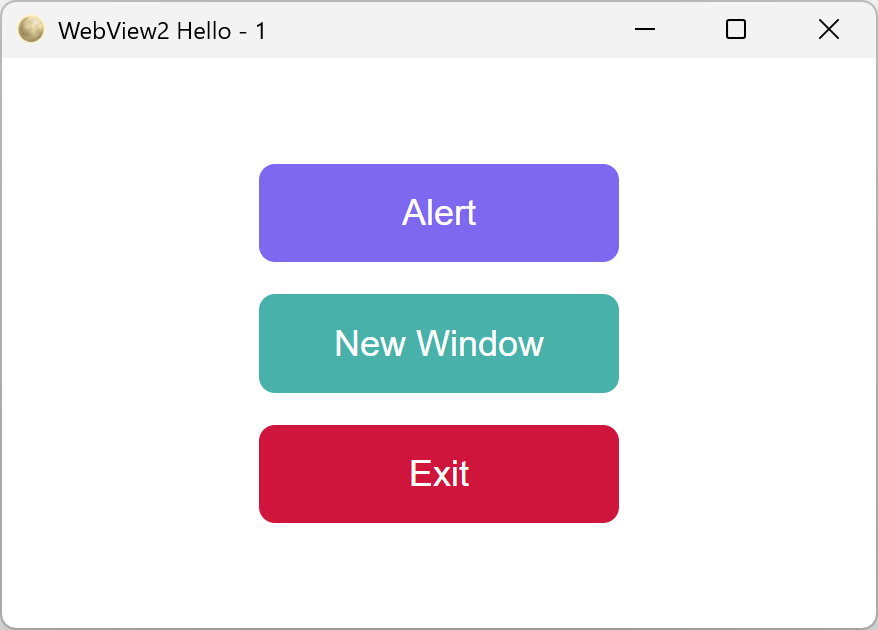
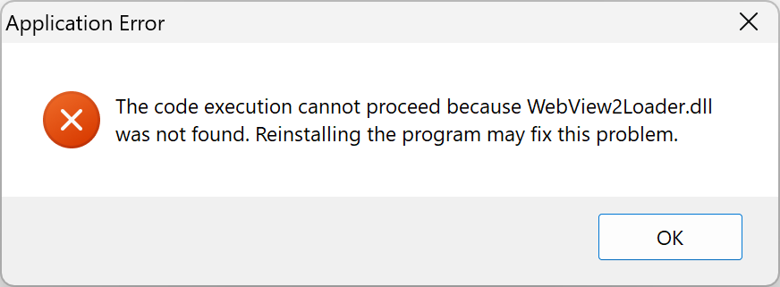

# Building a GUI with WebView2

* [Overview](#overview)
* [Preparation](#preparation)
  * [Initializing the library](#initializing-the-library)
  * [The HTML/CSS/JavaScript code](#the-htmlcssjavascript-code)
  * [Loading the HTML](#loading-the-html)
* [Events sent from JavaScript](#events-sent-from-javascript)
  * [Event type](#event-type)
  * [Sending events](#sending-events)
  * [Receiving events](#receiving-events)
* [Events sent from Lua](#events-sent-from-lua)
  * [Event type](#event-type-1)
  * [Sending events](#sending-events-1)
  * [Receiving events](#receiving-events-1)
* [Event loop](#event-loop)
* [Further topics](#further-topics)
  * [Managing multiple windows](#managing-multiple-windows)
  * [Development cycle](#development-cycle)
  * [WebView2 reference](#webview2-reference)

# Overview

This guide shows how to build a **Windows GUI** using the [WebView2 interface](./comexe-reference-webview2.md). The `com.webview2` module is Windows-only. To work properly, `WebView2Loader.dll` must be next to the executable or in `PATH`. The module can be used to develop GUI applications with modern web libraries like [React](https://react.dev) and [Vue](https://vuejs.org/).

For simplicity, this example uses a single self-contained `index.html` containing all the necessary HTML/CSS/JavaScript code. The WebView can also load a page from a local HTTP server by passing the server URL instead of an HTML string.



The full listing is available in **[test-win32-webview2.lua](../tests/examples/test-win32-webview2.lua)** and **[test-win32-webview2.html](../tests/examples/test-win32-webview2.html)**.

# Preparation

## Initializing the library

The `com.webview2` module loads `WebView2Loader.dll` at runtime:

```
local webview = require("com.webview2")
local win32   = require("com.win32")

-- Try to load WebView2Loader.dll
local InitSuccess, InitErrorString = webview.init()
if (not InitSuccess) then
  win32.messagebox(nil, InitErrorString, "Application Error", "OK", "ERROR")
  os.exit(1)
end
```

If the DLL is not found, the program displays an error:



## The HTML/CSS/JavaScript code

The file contains all the HTML/CSS/JavaScript code. It can be written by hand or built from separate sources with [Node.js](https://nodejs.org/) or [bun](https://bun.sh).

**[test-win32-webview2.html](../tests/examples/test-win32-webview2.html)**

```html
<!DOCTYPE html>
<html>
  <head>
    <style>
      body {
        display:flex;
        flex-direction:column;
        align-items:center;     /* horizontally */
        justify-content:center; /* vertically   */
        height:100vh;
        margin:0;
        gap:1em;
      }
      button {
        width:10em;
        padding:14px 0;
        font-size:large;
        cursor:pointer;
        border:none;
        border-radius:8px;
        color:white;
      }
      button:hover { filter:brightness(1.2); }
      .hello { background: mediumslateblue; }
      .new   { background: lightseagreen;   }
      .exit  { background: crimson;         }
    </style>
    <script>
      <!-- JavaScript to Lua -->
      function PostEvent (Name) {
        window.chrome.webview.postMessage(JSON.stringify(Name))
      }
      <!-- Lua to JavaScript -->
      window.chrome.webview.addEventListener('message', function (Event) {
        if (Event.data.type === 'alert') alert(Event.data.text)
      })
      <!-- Auto-exit after 5 seconds -->
      setTimeout(function () { PostEvent('exit') }, 5000)
    </script>
  </head>
  <body>
    <button class="hello" onclick="PostEvent('hello')">Alert</button>
    <button class="new"   onclick="PostEvent('new')">New Window</button>
    <button class="exit"  onclick="PostEvent('exit')">Exit</button>
  </body>
</html>
```

The embedded JavaScript code implements the core of event management:

- **JavaScript to Lua:** `PostEvent` sends an event to the Lua side
- **Lua to JavaScript:** the `message` listener receives events from the Lua side

Because this example is part of the automated tests, the page closes itself after a timeout. A real application should not include this code:

```html
<!-- Auto-exit after 5 seconds -->
setTimeout(function () { PostEvent('exit') }, 5000)
```

## Loading the HTML

`Runtime.loadresource` returns the contents of a file, from the filesystem or from the executable, depending on how the program runs:

- When run as a script (interpreter mode), it returns the contents of the file on disk
- When compiled into a [standalone executable](#development-cycle), it returns the contents packaged in the executable

```
local Runtime = require("com.runtime")
local win32   = require("com.win32")

-- Read the HTML code from file (dev) or from executable (production)
local Html = Runtime.loadresource("test-win32-webview2.html")
if (not Html) then
  win32.messagebox(nil, "Failed to load HTML", "Application Error", "OK", "ERROR")
  os.exit(1)
end
```

# Events sent from JavaScript

## Event type

An event is a `JSON` value that is sent from the JavaScript side to the Lua side. It can be any value that can be serialized by [JSON.stringify](https://developer.mozilla.org/en-US/docs/Web/JavaScript/Reference/Global_Objects/JSON/stringify).

```javascript
<!-- JavaScript to Lua -->
function PostEvent (Name) {
  window.chrome.webview.postMessage(JSON.stringify(Name))
}
```

## Sending events

In this example, events are simple strings.

```
<button class="hello" onclick="PostEvent('hello')">Alert</button>
```

Complex projects can use JavaScript objects instead of strings to carry more information.

## Receiving events

A WebView is created with an event handler:

```
local WebView = webview.new(Html, WebViewEventHandler)
```

The event handler is a function with two parameters:

| Parameter | Description                                                                                |
|-----------|--------------------------------------------------------------------------------------------|
| `WebView` | The WebView that received the event                                                        |
| `UiEvent` | The event, decoded into a Lua value with the [dkjson library](https://dkolf.de/dkjson-lua) |

```lua
local WindowCount = 1

local function WebViewEventHandler (WebView, UiEvent)
  if (UiEvent == "hello") then
    local NewEvent = { type = "alert", text = "Hello from Lua!" }
    WebView:send(NewEvent)
  elseif (UiEvent == "new") then
    WindowCount = (WindowCount + 1)
    local Child = webview.new(Html, WebViewEventHandler)
    local Title = string.format("WebView2 Hello - %d", WindowCount)
    Child:show(Title)
  elseif (UiEvent == "exit") then
    WebView:close()
  end
end
```

# Events sent from Lua

## Event type

An event is a Lua value that is sent from the Lua side to the JavaScript side. It can be any value that can be serialized by the [dkjson library](https://dkolf.de/dkjson-lua).

```lua
local NewEvent = {
  type = "alert",
  text = "Hello from Lua!"
}
```

## Sending events

`WebView:send` serializes the value to JSON and posts it to the page:

```
WebView:send(NewEvent)
```

## Receiving events

The name `"message"` is imposed by the WebView2 API. The event content is available in `Event.data`:

```
<!-- Lua to JavaScript -->
window.chrome.webview.addEventListener('message', function (Event) {
  if (Event.data.type === 'alert') alert(Event.data.text)
})
```

The event values are retrieved from the `Event.data` object:

| Field | Lua           | JavaScript      | Value             |
|-------|---------------|-----------------|-------------------|
| type  | NewEvent.type | Event.data.type | "alert"           |
| text  | NewEvent.text | Event.data.text | "Hello from Lua!" |

# Event loop

The blocking function `runloop` runs the event loop and returns when the last window is closed:

```lua
local WebView = webview.new(Html, WebViewEventHandler)
local Title   = string.format("WebView2 Hello - %d", WindowCount)
WebView:show(Title)
webview.runloop()
```

# Further topics

## Managing multiple windows

The `"new"` event creates an additional window:

```
elseif (UiEvent == "new") then
  WindowCount = (WindowCount + 1)
  local Child = webview.new(Html, WebViewEventHandler)
  local Title = string.format("WebView2 Hello - %d", WindowCount)
  Child:show(Title)
```

The `"exit"` event closes the window:

```
elseif (UiEvent == "exit") then
  -- Close this window
  WebView:close()
end
```

## Development cycle

During development, the program is run directly with the interpreter:

```console
> lua55ce.exe tests\examples\test-win32-webview2.lua
```

When development is complete, the program can be compiled into a standalone program:

```console
lua55ce.exe -x --make tests\examples\test-win32-webview2.lua -t x86_64-windows-gui
```

GUI programs have no console output, so the code reports errors with `win32.messagebox` instead of `print`.

## WebView2 reference

For more details, see the [WebView2 reference](./comexe-reference-webview2.md).
